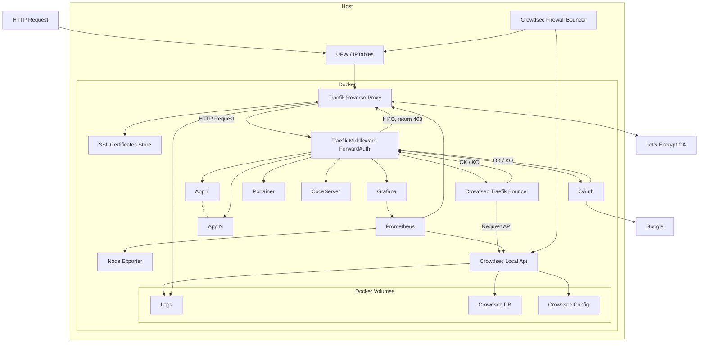

# Welcome

Welcome to Project Jacker :heart:{ .heart }, a powerful Docker stack combining Traefik and CrowdSec for enhanced security in your production public sites hosting, and Google Oauth for SSO to your management and monitoring tools.

Jacker is also intended to be a solid foundation on which to host new stacks of Docker-based components, establishing a series of foundations, standards and good practices to guarantee the security and stability necessary for any production system.

## Jacker = Jacar + Docker

Project Jacker brings together four robust components:

- **Traefik Reverse Proxy**: Traefik is a modern reverse proxy and load balancer that simplifies routing, SSL termination, and service discovery for your Docker containers. It seamlessly integrates with your stack, ensuring smooth traffic flow and secure communication.

- **CrowdSec**: CrowdSec is a community-driven security solution that analyzes attacks in real time. It provides a console where you can dive into detailed information about IPs, including their activity rate, danger score, and the types of attacks they’ve carried out. With CrowdSec, you’ll be able to automatically ban malicious IPs from accessing your container services, bolstering your defenses.

- **OAuth**: OAuth (Open Authorization) is a standard protocol for secure authorization. Google provides OAuth services for authentication. Single Sign-On (SSO): OAuth allows users to authenticate once and access multiple services without repeated logins.

- **Monitoring: Prometheus & Node Exporter & Grafana**: Essential monitoring stack to watch what's happening in your setup:

    - Prometheus is an open-source monitoring system that provides robust metrics collection, storage, and alerting capabilities. It’s widely used in the DevOps and cloud-native ecosystem. 
    - Node Exporter, also known as Prometheus Node Exporter, is an essential component in the Prometheus ecosystem. It serves as a bridge between your Linux hosts and Prometheus, providing a wealth of hardware- and kernel-related metrics. When you run the Node Exporter on a machine, it collects crucial system information such as CPU usage, memory utilization, network statistics, disk space, and system load.
    - Grafana is a versatile open-source analytics and interactive visualization web application. It serves as a powerful tool for creating charts, graphs, and alerts when connected to supported data sources. Whether you’re monitoring system metrics, visualizing time series data, or building custom dashboards, Grafana provides an intuitive interface that empowers users to explore and understand their data effectively.

## What's In The Box

All internal services protected by Google OAuth with Single Sign On:

{ .center-image }

- https://traefik.mybox.example.com 

{ .center-image }

- https://portainer.mybox.example.com 

{ .center-image }

- https://grafana.mybox.example.com

{ .center-image }

- https://code.mybox.example.com

{ .center-image }
